# cv

# 🖥️ RHEL Home Lab Project

This repository documents my **Red Hat Enterprise Linux (RHEL) home lab**, where I set up and configured core sysadmin tasks.  
It covers **user management, storage, automation, networking, services, and monitoring**

---

## 🔹 1. System Basics & Users
- Created and managed local users and groups
- Configured password policies and permissions

  
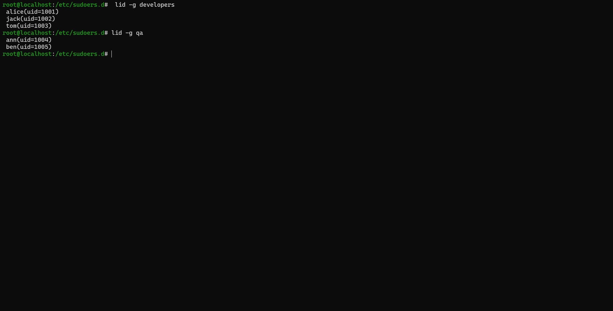  
  
  
  

---

## 🔹 2. Storage Management
- Added new disk and created standard partitions
- Configured **Logical Volume Management (LVM)** for flexible storage

  
  
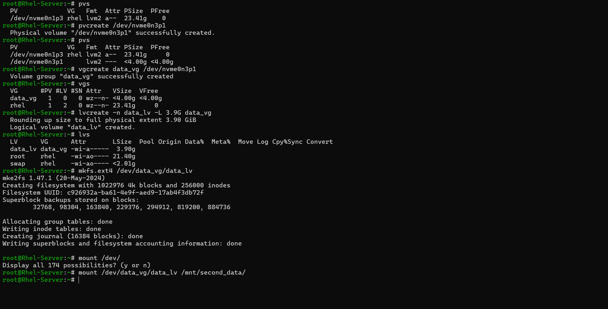  

---

## 🔹 3. Task Automation (Bash & Cron)
- Automated backups and health checks with Bash scripting
- Scheduled tasks using `cron`

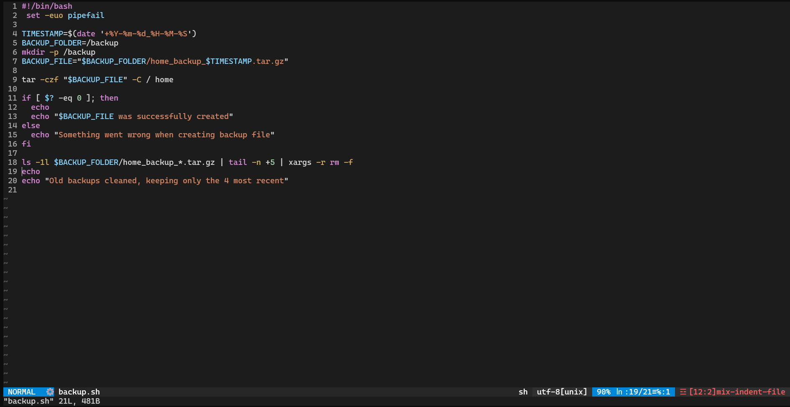  
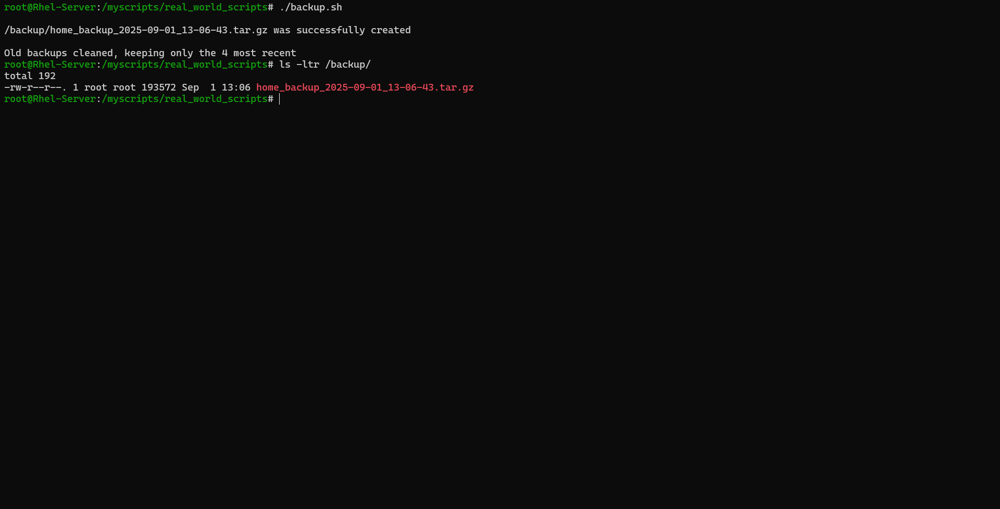  
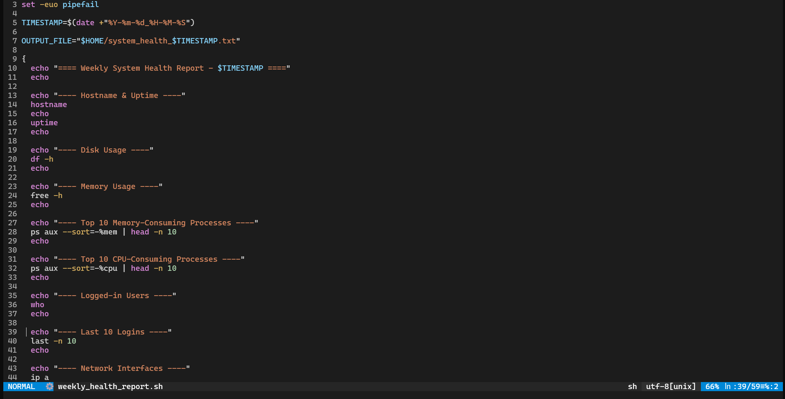  
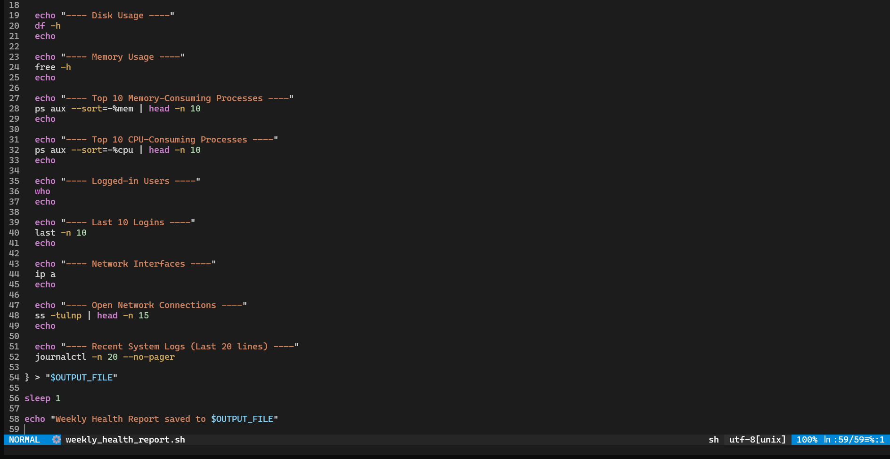  
  
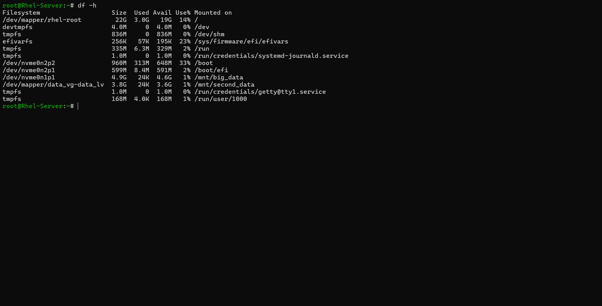  
  
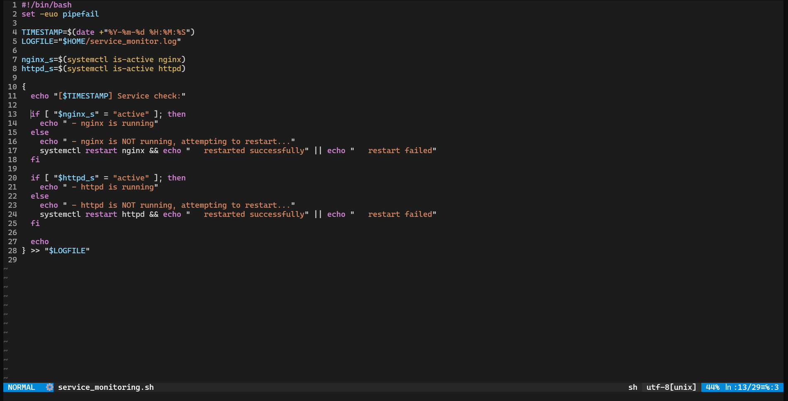  

---

## 🔹 4. Networking & Services
- Configured firewall rules with **firewalld**
- Set up and managed **Apache (httpd)** and **Nginx** web servers
- Configured **NFS** for Linux file sharing
- Configured **Samba** for Windows/Linux file sharing
- Set up **DNS (BIND)** server

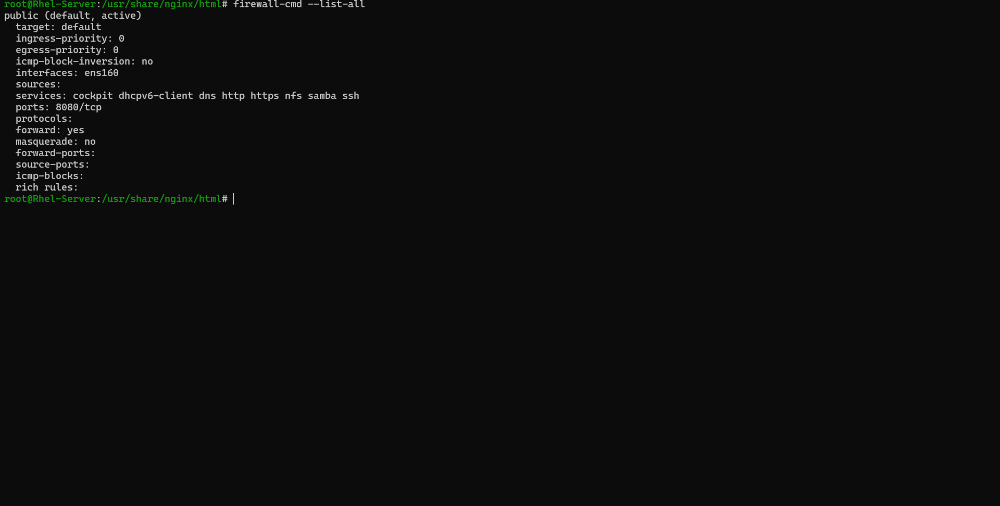  
  
  
_website.png)  
  
  
  
  
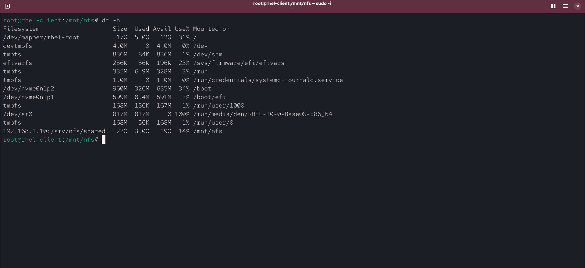  
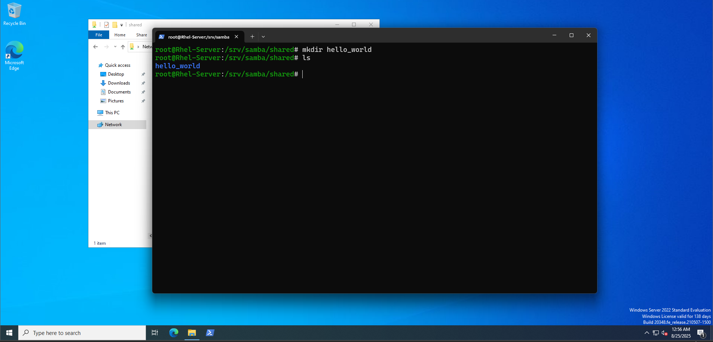  
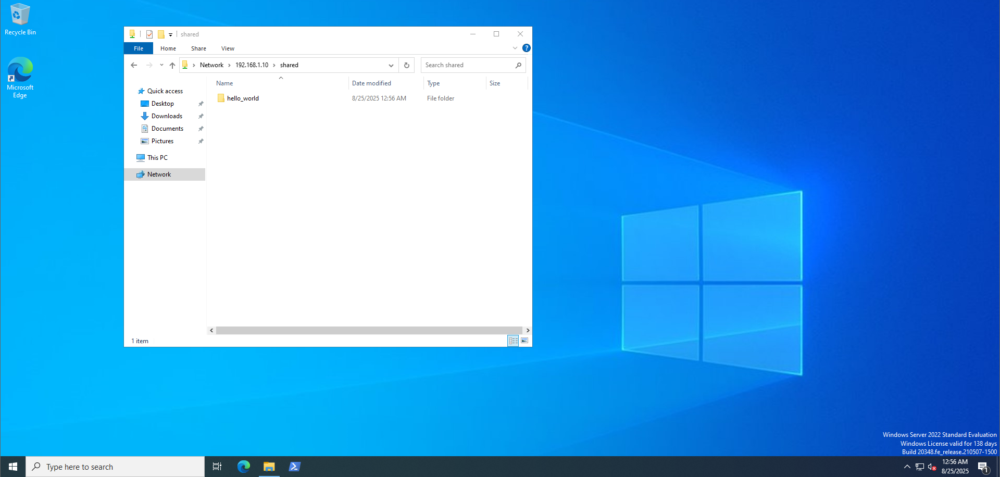  
.png)  

---

## 🔹 5. Monitoring & Security
- Installed and configured **Nagios** for system and service monitoring

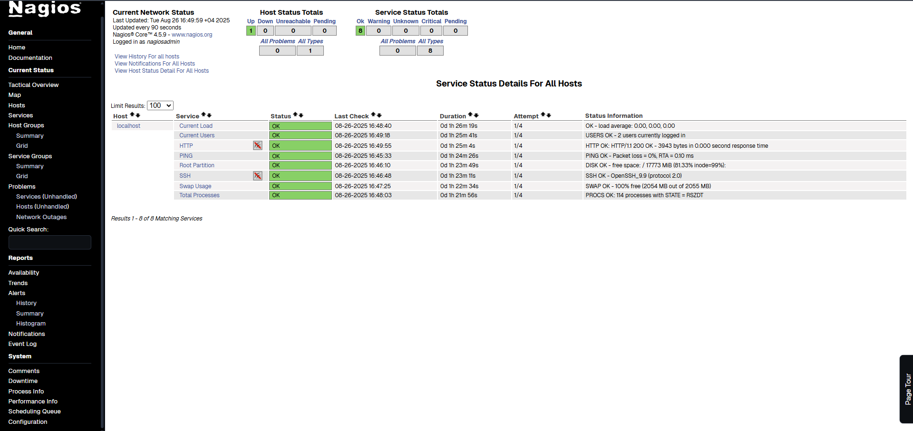  

---

## 📌 Skills Demonstrated
- Linux user & permission management
- Storage configuration (LVM, partitions)
- Automation with Bash & Cron
- Network services (Apache, Nginx, DNS, NFS, Samba)
- Security hardening (firewalld, SELinux basics)
- Monitoring with Nagios

---

